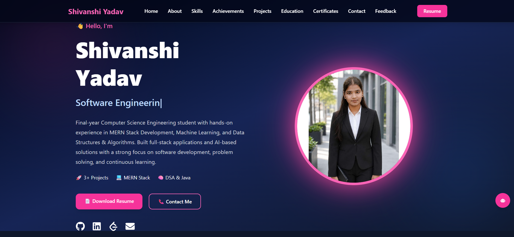

# 🌟 Shivanshi Yadav - Portfolio




---

## 📖 Description

A modern, responsive, and interactive personal portfolio website built using React, Vite, Tailwind CSS, Framer Motion, and EmailJS.

The portfolio showcases my projects, technical skills, certifications, education, achievements, and development journey while providing recruiters and visitors with an engaging user experience.

---

## 🌐 Live Portfolio

🚀 **Website:**  
https://my-portfolio-beta-seven-imc1bckef4.vercel.app/

---

## 👨‍💻 About Me

I am **Shivanshi Yadav**, a final-year Computer Science Engineering student passionate about Full-Stack Development, Machine Learning, and Software Engineering.

I enjoy building real-world applications, solving complex problems, and continuously improving my technical skills through projects, certifications, and hands-on learning.

---

## ✨ Features

- Responsive Modern UI
- Interactive AI Portfolio Assistant
- Project Showcase Section
- Education Timeline
- Skills Section
- Certifications Section
- Achievements Section
- Resume Download
- EmailJS Contact Form
- Smooth Animations using Framer Motion
- Mobile-Friendly Design
- Fast Performance with Vite
- Clean and Professional Layout

---

## 🛠️ Tech Stack


---

## 📂 Featured Projects

### 🚀 CivicWatch AI

A Smart Civic Issue Reporting & Monitoring System developed using the MERN Stack. The platform enables citizens to report, track, and monitor civic issues through an interactive dashboard.

**Tech Stack:**  
MongoDB • Express.js • React.js • Node.js • JWT • Tailwind CSS

---

### 🤖 Fake Job Posting Detection System

A Machine Learning and NLP-powered application that identifies fraudulent job postings and helps users avoid job scams through real-time verification.

**Tech Stack:**  
Python • Scikit-Learn • NLP • Pandas • Streamlit • XGBoost

---

### 📋 ProjectFlow

A MERN-based Student Project Management System that helps students manage projects, tasks, deadlines, and collaboration effectively.

**Tech Stack:**  
MongoDB • Express.js • React.js • Node.js • Tailwind CSS

---

## 🏆 Certifications

- AI/ML Internship Certificate
- LLM For Young Developers – Foundational Course
- Data Structures & Algorithms Training
- MERN Stack Development Training
- FutureSkills Prime Certifications

---

## 🎯 Skills

### Programming Languages
- Java
- JavaScript
- Python
- SQL

### Web Development
- React.js
- Node.js
- Express.js
- MongoDB
- Tailwind CSS

### Machine Learning & AI
- Machine Learning
- Natural Language Processing (NLP)
- Scikit-Learn
- XGBoost

### Tools & Platforms
- Git
- GitHub
- Vercel
- Render
- Streamlit
- MongoDB Atlas

---

## 📸 Portfolio Preview

### Home Page


---

## 📫 Contact

📧 **Email:**  
yadavshivanshi636@gmail.com

🔗 **LinkedIn:**  
https://www.linkedin.com/in/shivanshi-yadav-593188308

💻 **GitHub:**  
https://github.com/shivanshiyadav2004

🧩 **LeetCode:**  
https://leetcode.com/u/Shivanshi_Yadav_159/

---

## ⚙️ Installation

### Clone Repository

```bash
git clone https://github.com/shivanshiyadav2004/my-portfolio.git
```

### Navigate to Project Directory

```bash
cd my-portfolio
```

### Install Dependencies

```bash
npm install
```

### Run Development Server

```bash
npm run dev
```

### Build for Production

```bash
npm run build
```

---

## 📈 Future Enhancements

- Blog Section
- Dark/Light Theme Toggle
- Project Filtering
- Advanced AI Assistant
- Visitor Analytics Dashboard
- Multi-Language Support

---

## 👨‍🎓 Author

**Shivanshi Yadav**

Computer Science Engineering Student

Passionate about Full-Stack Development, Machine Learning, and Building Real-World Software Solutions.

---

## ⭐ Support

If you found this portfolio useful, consider giving it a ⭐ on GitHub.

---

## 📄 License

This project is open-source and available for learning and educational purposes.
